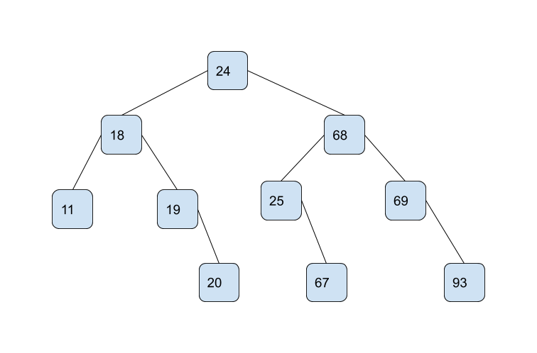
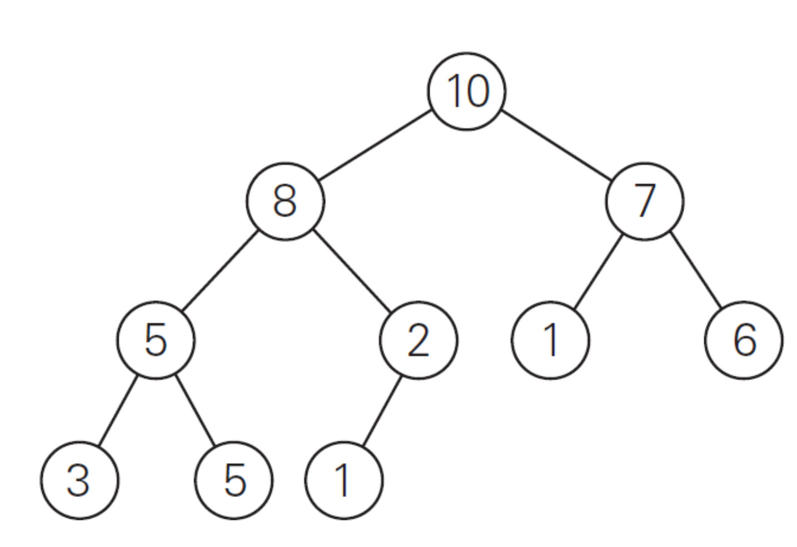

# Homework 4: Decrease/Divide and Conquer

*I pledge my honor that I have abided by the Stevens Honor System.* - Joshua Schmidt

Name: Joshua Schmidt, Date: 10/31/19

1. Consider the algorithm on page 148 in the textbook for binary reflected Gray codes. What change(s) would you make so that it generates the binary numbers in order for a given length n? Your algorithm must be recursive and keep the same structure as the one in the textbook. Describe only the change(s). (10 points)

In order to output the binary reflected Gray code in order, the only change needed would be to copy list $L1$ to $L2$ in the same order, instead of reversing it. So the final algorithm would be as follows:

pseudocode:

```bash
BRGC(n):
  if n == 1 :
    make list L containing bit strings 0 and 1 in this order
  else :
    generate list L1 of bit strings of size n − 1 by calling BRGC(n − 1)
    copy list L1 to list L2 in same order # changed line
    add 0 in front of each bit string in list L1
    add 1 in front of each bit string in list L2
    append L2 to L1 to get list L
  return L
```

python:

```python
def brgc(n):
  if n == 1:
    return ['0', '1']
  l1 = brgc(n - 1)
  l2 = l1.copy() # changed line
  for i in range(len(l1)):
    l1[i] = '0' + l1[i]
    l2[i] = '1' + l2[i]
  l1.extend(l2)
  return l1
```

2. Show the steps to multiply 72 x 93 with Russian peasant multiplication, as seen in Figure 4.11b on page 154 in the textbook. (10 points)

| n  | m           |
|----|-------------|
| 72 | 93          |
| 36 | 186         |
| 18 | 372         |
| 9  | 744         |
| 4  | 1488 (+744) |
| 2  | 2976        |
| 1  | 5952        |

72 x 93 = 5952 + 744 = 6696

1. Suppose you use the LomutoPartition() function on page 159 in the textbook in your
implementation of quicksort. (10 points, 5 points each)

a. Describe the types of input that cause quicksort to perform its worst-case running time.

Arrays that are reverse-sorted have the worst running time for LomutoPartiton() and QuickSort. This is because the pivot is taken as the left most element in the array during each call to QuickSort. Because the left most element is the largest element for each sub-array, there will be a swap for each element in the sub arrays. This results in the worst-case running time of $\theta (n^{2})$.

b. What is that running time?

    $\theta (n^{2})$

4. Compute 2205 x 1132 by applying the divide-and-conquer algorithm outlined in the text. Repeat the process until the numbers being multiplied are each 1 digit. For each multiplication, show the
values of c2, c1, and c0. Do not skip steps. (10 points)

- 2205 x 1132
- $c = 2205 \cdot 1132 = c_{2} \cdot 10^{4} + c_{1} \cdot 10^{2} + c_{0}$
- $c_{2} = 22 \cdot 11$
  - $c_{2} = 22 \cdot 11 = c_{2a} \cdot 10^{2} + c_{1a} \cdot 10^{1} + c_{0a}$
  - $c_{2a} = a_{1} \cdot b_{1} = 2 \cdot 1 = 2$
  - $c_{0a} = a_{0} \cdot b_{0} = 2 \cdot 1 = 2$
  - $c_{1a} = (a_{1} + a_{0}) \cdot (b_{1} + b_{0}) - (c_{2a} + c_{0a}) = (2 + 2) \cdot (1 + 1) - (2 + 2) = 4$
  - $c_{2} = 2 \cdot 10^{2} + 4 \cdot 10^{1} + 2 = 242$
- $c_{0} = a_{0} \cdot b_{0} = 5 \cdot 32$
  - $c_{0} = 5 \cdot 32 = c_{2b} \cdot 10^{2} + c_{1b} \cdot 10^{1} + c_{0b}$
  - $c_{2b} = a_{1} \cdot b_{1} = 0 \cdot 3 = 0$
  - $c_{0b} = a_{0} \cdot b_{0} = 5 \cdot 2 = 10$
  - $c_{1b} = (a_{1} + a_{0}) \cdot (b_{1} + b_{0}) - (c_{2b} + c_{0b}) = (0 + 5) \cdot (3 + 2) - (0 + 10) = 15$
  - $c_{2} = 0 \cdot 10^{2} + 15 \cdot 10^{1} + 10 = 160$
- $c_{1} = (a_{1} + a_{0}) \cdot (b_{1} + b_{0}) - (c_{2} + c_{0}) = (22 + 5) \cdot (11 + 32) - (242 + 160) = 27 \cdot 43 - 402$
  - $27 \cdot 43 = c_{2c} \cdot 10^{2} + c_{1c} \cdot 10^{1} + c_{0c}$
  - $c_{2c} = a_{1} \cdot b_{1} = 2 \cdot 4 = 8$
  - $c_{0c} = a_{0} \cdot b_{0} = 7 \cdot 3 = 21$
  - $c_{1c} = (a_{1} + a_{0}) \cdot (b_{1} + b_{0}) - (c_{2c} + c_{0c}) = (2 + 7) \cdot (4 + 3) - (8 + 21) = 63 - 29 = 34$
  - $27 \cdot 43 = 8 \cdot 10^{2} + 34 \cdot 10^{1} + 21 = 1161$
- $c_{1} = 1161 - 402 = 759$
- $c = 2205 \cdot 1132 = 242 \cdot 10^{4} + 759 \cdot 10^{2} + 160 = 2496060$

5. Draw the binary search tree after inserting the following keys: 24 18 67 68 69 25 19 20 11 93 (10 points)



1. Consider the following binary tree. (16 points, 2 points each)



a. Traverse the tree preorder.

[10, 8, 5, 3, 5, 2, 1, 7, 1, 6]

b. Traverse the tree inorder.

[3, 5, 5, 8, 1, 2, 10, 1, 7, 6]

c. Traverse the tree postorder.

[3, 5, 5, 1, 2, 8, 1, 6, 7, 10]

d. How many internal nodes are there?

5 (nodes with child nodes)

e. How many leaves are there?

5 (nodes without child nodes)

f. What is the maximum width of the tree?

4 (max width of all levels)

g. What is the height of the tree?

3 (max number of edges from root to leaf)

h. What is the diameter of the tree?

5 (longest path between two nodes in tree)

7. Use the Master Theorem to give tight asymptotic bounds for the following recurrences. (25 points, 5 points each)
   1. $T(n) = 2 \cdot T(\frac{n}{4}) + 1$
      1. $a = 2$, $b = 4$, $d = 0$
      2. $a > b^{d}$: $2 > 4^{0}$
      3. $T(n) \in n^{\log _{b} (a)}$
      4. $T(n) \in n^{\log _{4} (2)}$
      5. $T(n) \in n^{\frac{1}{2}}$
   2. $T(n) = 2 \cdot T(\frac{n}{4}) + \sqrt{n}$
      1. $a = 2$, $b = 4$, $d = \frac{1}{2}$
      2. $a = b^{d}$: $2 = 4^{\frac{1}{2}}$
      3. $T(n) \in n^{d} \cdot \log _{b} (n)$
      4. $T(n) \in n^{\frac{1}{2}} \cdot \log _{4} (n)$
   3. $T(n) = 2 \cdot T(\frac{n}{4}) + n$
      1. $a = 2$, $b = 4$, $d = 1$
      2. $a < b^{d}$: $2 < 4^{1}$
      3. $T(n) \in n^{d}$
      4. $T(n) \in n^{1}$
      5. $T(n) \in n$
   4. $T(n) = 2 \cdot T(\frac{n}{4}) + n^{2}$
      1. $a = 2$, $b = 4$, $d = 2$
      2. $a < b^{d}$: $2 < 4^{2}$
      3. $T(n) \in n^{d}$
      4. $T(n) \in n^{2}$
   5. $T(n) = 2 \cdot T(\frac{n}{4}) + n^{3}$
      1. $a = 2$, $b = 4$, $d = 3$
      2. $a < b^{d}$: $2 < 4^{3}$
      3. $T(n) \in n^{d}$
      4. $T(n) \in n^{3}$

8. Consider the following function. (9 points)

```c++
int function(int n) {
 if (n <= 1) {
  return 0;
 }
 int temp = 0;
 for (int i = 1; i <= 6; ++i) {
  temp += function(n / 3);
 }
 for (int i = 1; i <= n; ++i) {
  for (int j = 1; j * j <= n; ++j) {
    ++temp;
  }
 }
 return temp;
}
```

  1. Write an expression for the runtime $T(n)$ for the function. (4 points)

$T(n) = 6 \cdot T(\frac{n}{3}) + \theta (n \cdot \sqrt{n})$

  2. Use the Master Theorem to give a tight asymptotic bound. Simplify your answer as much as possible. (5 points)
    1. $a = 6$, $b = 3$, $d = \frac{3}{2}$
    2. $a > b^{d}$: $6 > 3^{\frac{3}{2}}$
    3. $T(n) \in n^{\log _{b} (a)}$
    4. $T(n) \in n^{\log _{3} (6)}$
