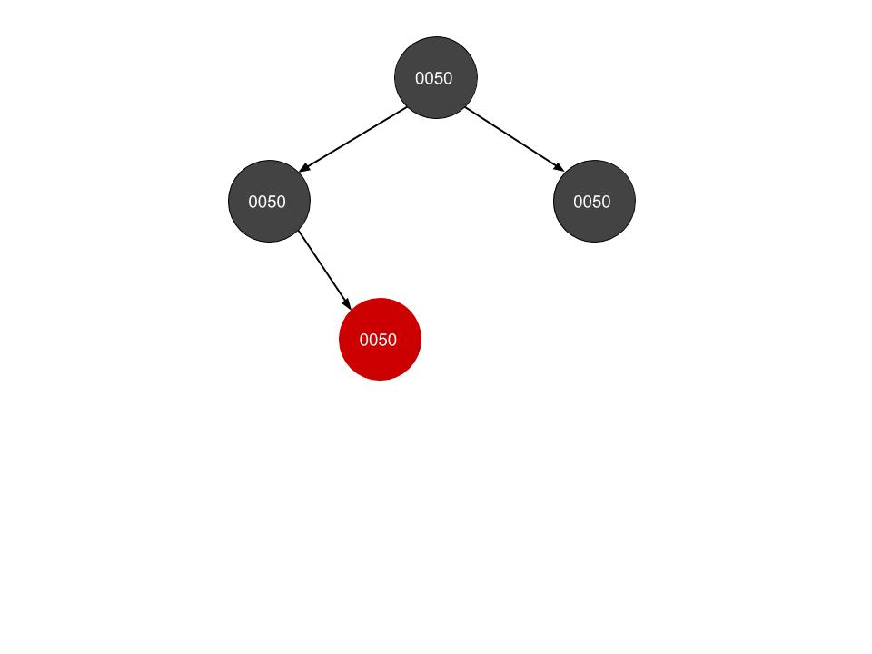

# Homework 5: Balanced Trees and Transform‐and‐Conquer

1. Show how the red‐black tree would look after inserting a node with the key 0043.  Use the document on Moodle that explains the insertion process succinctly.  List the case you applied (i.e. 1, 2a, 3b), and write the steps you took to fix the tree (also listed in the document).

a. Draw the tree after a regular binary search tree insertion. (3 points)
b. Which property is violated?
