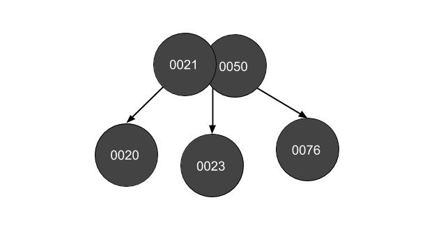

# Homework 5: Balanced Trees and Transform‐and‐Conquer

*I pledge my honor that I have abided by the Stevens Honor System.* - Joshua Schmidt

1. Show how the red‐black tree would look after inserting a node with the key 0043.  Use the document on Moodle that explains the insertion process succinctly.  List the case you applied (i.e. 1, 2a, 3b), and write the steps you took to fix the tree (also listed in the document).


a. Draw the tree after a regular binary search tree insertion. (3 points)


b. Which property is violated?

If a node is red, then both its children are black.

Case seen after regular binary search tree insertion: case 2b

Steps taken to fix tree:

- z = parent(z)
- right rotate about z, or 0045


b. Which property is violated?

If a node is red, then both its children are black.

Case seen after regular binary search tree insertion: case 3b

- parent(z).color = black
- parent(parent(z)).color = red
- left rotate about parent(parent(z)), or 0040


2. Draw the 2-3 tree after inserting each of the following keys. Redraw the tree for each part.

a. add 50


b. add 76


c. add 23


d. add 21


e. add 20



f. add 19


g. add 18


3. write pseudocode for lcm - doing python

```python
def gcd(a, b):
  if (a == 0):
    return b
  return gcd(b % a, a)

def lcm(A):
  if len(A) < 2:
    return None
  res = A[0]
  for i in range(1, len(A)):
    res = res * A[i] / gcd(res, A[i])
  return res
```

4. Horner's method

$p(x) = 4 \cdot x^4 + 5 \cdot x^3 - 2 \cdot x^2 - 4 \cdot x + 7$

a. repeatedly factor out x for the polynomial so that you can apply the method

- $p(x) = x \cdot (4 \cdot x^3 + 5 \cdot x^2 - 2 \cdot x - 4) + 7$
- $p(x) = x \cdot (x \cdot (4 \cdot x^2 + 5 \cdot x - 2) - 4) + 7$
- $p(x) = x \cdot (x \cdot (x \cdot (4 \cdot x + 5) - 2) - 4) + 7$
- $p(x) = x \cdot (x \cdot (x \cdot (x \cdot (4) + 5) - 2) - 4) + 7$

b. show values of the array P[n]

P = [7, -4, -2, 5, 4]

c. apply Horner's method to evaluate the polynomial at x=2, using the table below:

| x | p  | n | i |
|---|----|---|---|
| 2 | 4  | 4 | 4 |
|   | 13 |   | 3 |
|   | 24 |   | 2 |
|   | 44 |   | 1 |
|   | 95 |   | 0 |

p(2) = 95

d. Use synthetic division to divide p(x) by x - 2

$p(x) = 4 \cdot x^4 + 5 \cdot x^3 - 2 \cdot x^2 - 4 \cdot x + 7$ / $x - 2$

2 | 4  5 -2 -4  7
       8 26 48 88
-----------------
    4 13 24 44 95

$\frac{p(x)}{x-2} = 4 \cdot x^3 + 13 x^2 + 24 x + 44 + \frac{95}{x-2}$

5. left right binary exponentiation

```python
def left_right_binary_exponentiation(a, B):
  prod = 1
  for i in range(len(B), 0, -1):
    if i == len(B):
      prod = a
      continue
    prod *= prod
    if B[i] == 1:
      prod = prod * a
  return prod
```
