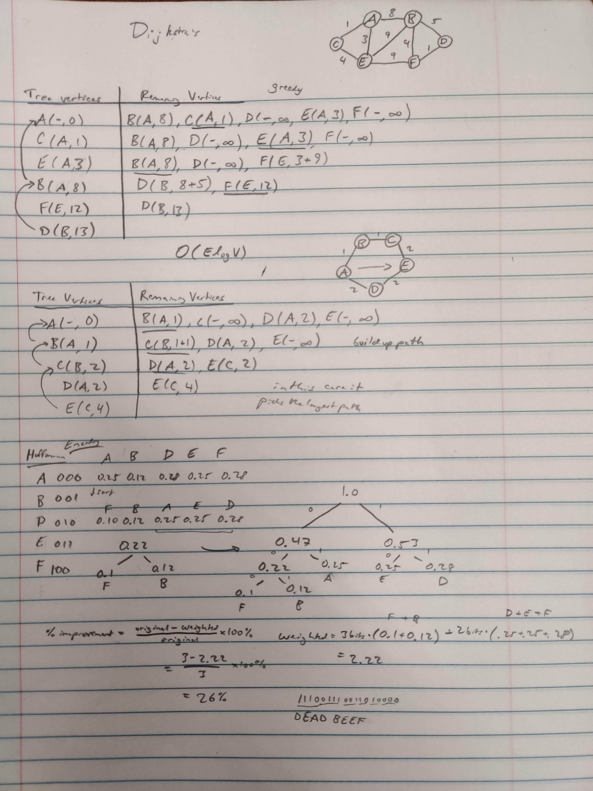

# Dijkstra's Algorithm

- single source shortest path
- (unlike floyd's with all paths)
- $\mathcal{0} (E \log V)$

## Huffman Encoding

- frequencies of letters
- make file smaller
- $percent_improvement = \frac{original - weighted}{original} \cdot 100$

