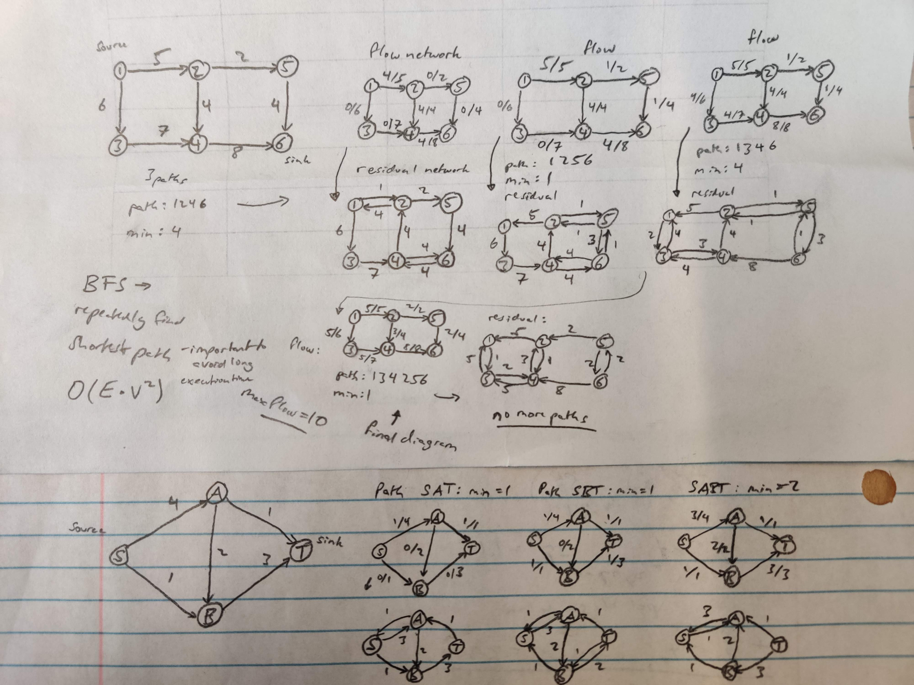

# Ford Fulkerson

- max flow
- tries to get max flow from source to sink, without overloading or underloading network
- iterative improvement
- BFS - repeatedly find the shortest path from source to sink in terms of number of edges (minimize the number of hops)
- maximize the whole system
- BFS step is important because if you don't pick the shortest, you can get much longer running times, or $\mathcal{O}(E \cdot F^*)$, where $E$ is the number of edges and $F^*$ is the max edge weight, instead of $\mathcal{O} (E \cdot V^2)$

