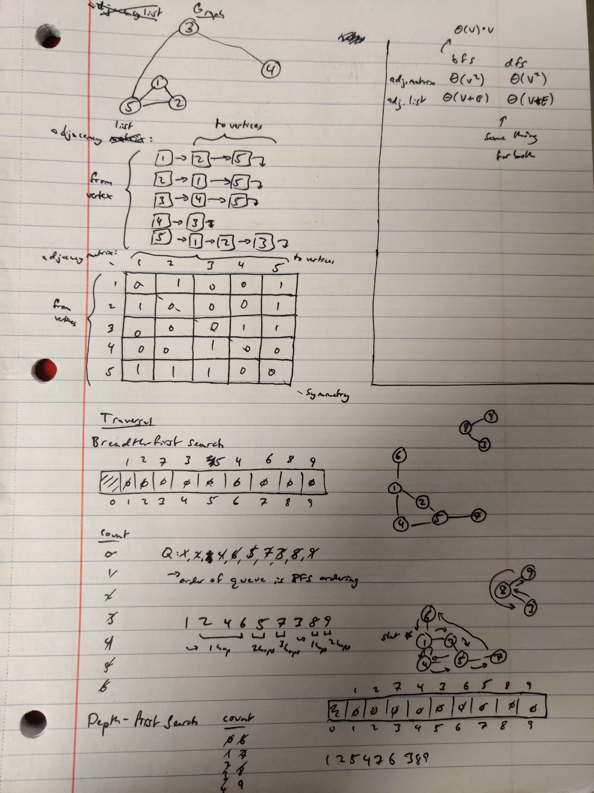

# graphs

a graph is a set of vertices and edges. A graph can be weighted or unweighted, directed or undirected.

- networks
- relations between people
- linked list doesn't really work because it is uni-directional and only pointing to one thing

## adjacency list

- create a node with a list of connected nodes
- main issue is it's difficult to look-up a number because you have to do a traversal
- runtime for determining if edge between 2 vertices - O(v) - v = vertices
  - O(d) where d is the degree of the vertex (O(d) is better if you know what d is)
- runtime for determining all vertices adjacent to a given vertex = Theta(d) or O(V)
- space requirement = Theta(V + E)
- use this when
  - large graphs
  - sparse graphs

## adjacency matrix - 2d array - another idea

- don't need to do traversal, but requires $n^{2}$ space.
- runtime for determining if edge between 2 vertices - Theta(1)
- runtime for determining all vertices adjacent to a given vertex = Theta(v)
- space requirement = Theta(V^2)
- use this when:
  - small graphs
  - dense graphs

when in doubt, choose the list (less memory is better)

## traversing graphs

### breadth-first search

- iterate over each vertex in order
- start with vertex 1, then check adjacents and get the order
- this uses a queue

### depth-first search

- opposite - go the furthest from the starting point (instead of staying close to the beginning)
- uses a stack

-> for both:

- adjacency matrix is Theta(v^2)
- adjacency list is Theta(V+E)

## graphs

