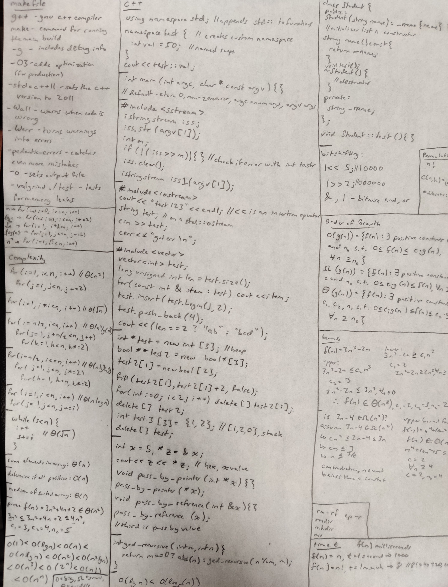
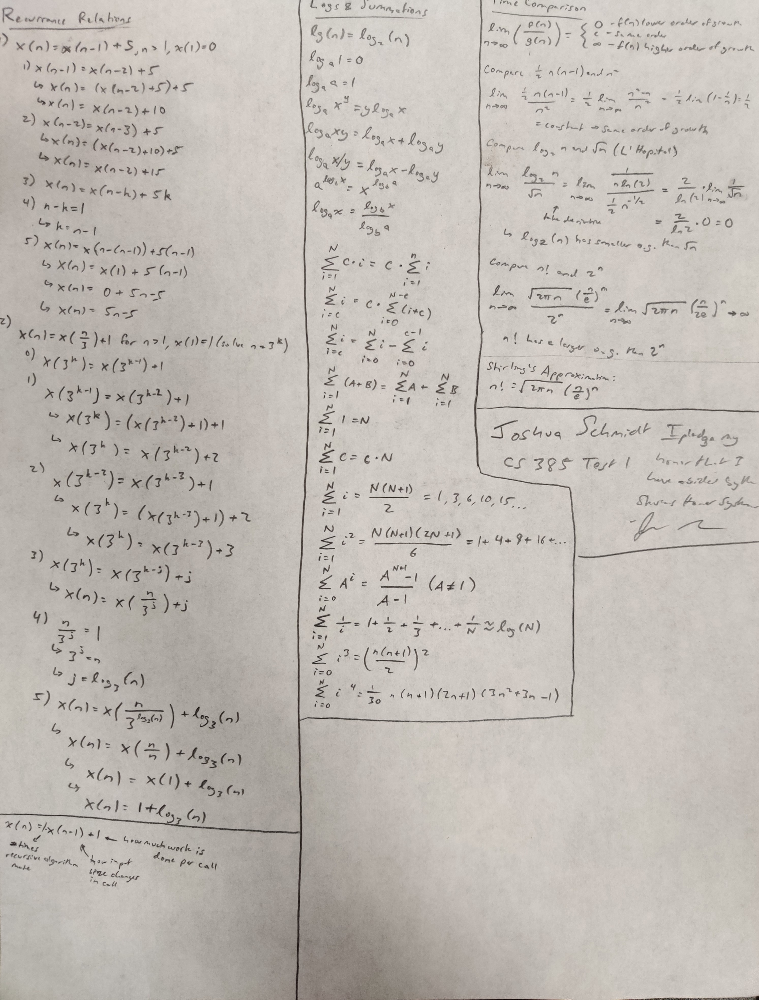

# cheat sheet

## make file

- `g++` is gnu c++ compiler
- `make` command for running the main build
- `-g` includes debug info in executable (for gdb usage)
- `-O3` adds optimization (for production)
- `-std=c++11` specifies using c++ version 11
- `-Wall` warns when code is wrong
- `-Werror` turns warnings into errors
- `-pedanic-errors` catches even more mistakes
- `-o` specifies the out file
- `valgrind ./test` to test for memory leaks

## c++

- ```c++
  using namespace std; // appends std:: to functions from std
- ```c++
  namespace test // create custom namespace
  { 
    int val = 500; 
  }
  cout << test::val;
  ```
- ```c++
  int main(int argc, char* const argv[]) {} // defaults to return 0, non-zero for error, argc is number of arguments, argv is the arguments themselves
- ```c++ 
  #include <sstream> // string stream class
  istringstream iss;
  iss.str(argv[1]);
  int m;
  if (!(iss >> m)) {} // got error
  iss.clear();
  // or:
  istringstream iss1(argv[1]);
  ```
- ```c++
  #include <iostream>
  cout << "test123" << endl;
  string test;
  cin >> test;
  cerr << "got error\n";
  ```
- ```c++
  #include <vector> // vector class
  vector<int> test;
  long unsigned int len = test.size(); // size
  for (const int& item : test) cout << item; // for-each
  test.insert(test.begin(), 2); // put at beginning
  test.push_back(3); // put at end
  cout << (len == 2 ? "test" : "asdf"); // single line if
  ```
- ```c++
  int *test = new int[3]; // put on heap
  bool **array = new bool*[3]; // 2d
  array[1] = new bool[2];
  fill(array[1], array[1] + 2, false);
  for (int i = 0; i < 2; i++) delete[] array[i];
  delete[] array;
  int test2[3] = {1, 2}; // [1, 2, 0], stack
  delete[] test;
  ```
- ```c++
  int x = 5, *z = &x;
  cout << z << *z; // hex, x value
  void pass_by_pointer(int *x) {}
  pass_by_pointer(*x);
  void pass_by_reference(int &x) {}
  pass_by_reference(x);
  // third is pass by value
  ```

## final cheat sheet




