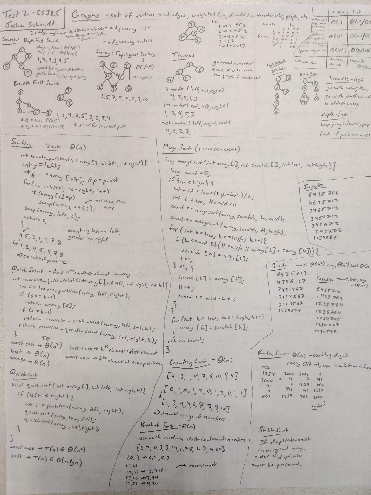
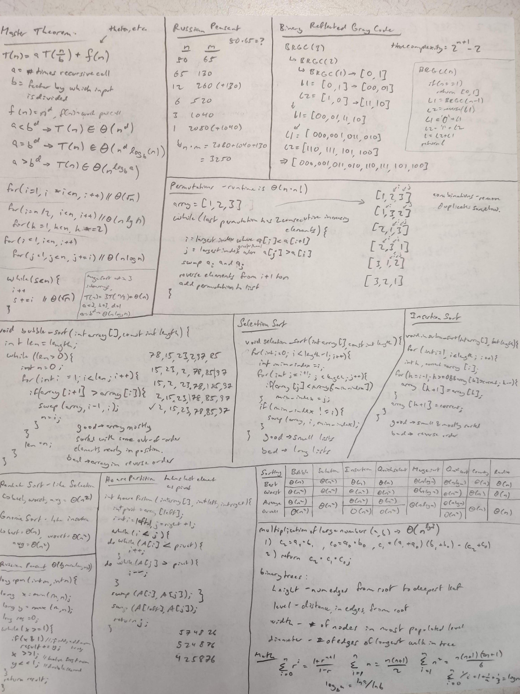

# test 2 review

- similar to quick select on quiz (some blank spaces), or shakersort - read, trace through and analyze
- not going to ask for tree for mergesort
- lomuto partition should be a piece of cake, same with depth-first, breadth-first, etc.
- russian peasant algorithm

## reflection

- merge sort always $\theta (n lg n)$
- be careful with merge vs insertion
- BRGC has a recurrence of $T(n) = T(n - 1) + 2^{n}$
  - $T(n) \in \theta (2^{n})$
- quicksort is not stable
- radix sort is stable

## cheat sheet

