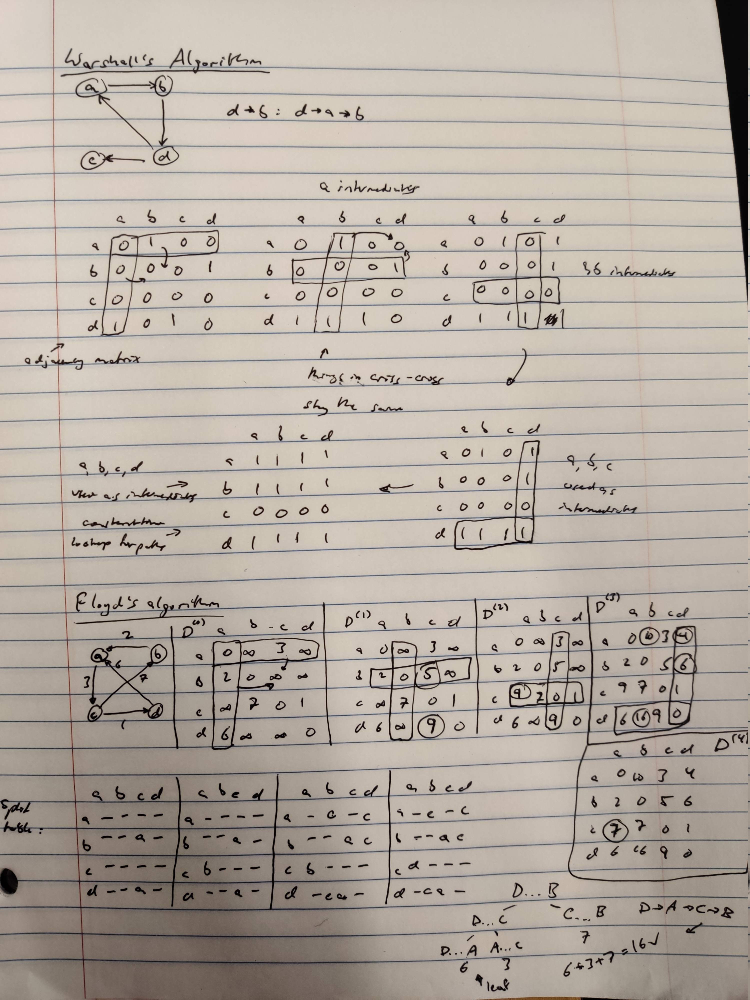

# warshall's algorithm

definition: the transitive closure of a directed graph with n vertices can be defined as the n x n boolean matrix $T={t_{ij}}$ in which the element in the $i^{th}$ row and $j^{th}$ column is 1 if there exists a nontrivial path (i.e., directed path of positive length) from the $i^{th}$ vertex to the $j^{th}$ vertex; otherwise, $t_{ij}$ is 0.

```bash
Warshall(A[1..n, 1..n])
  # Implements Warshall’s algorithm for computing the transitive closure
  # Input: The adjacency matrix A of a digraph with n vertices
  # Output: The transitive closure of the digraph
  R(0) ← A
  for k ← 1 to n do
    for i ← 1 to n do
      for j ← 1 to n do
        R (k) [i, j] ← R (k−1) [i, j] or (R (k−1) [i, k] and R (k−1) [k, j])
  return R (n)
```

## Floyd's algorithm - all pairs, shortest path

```bash
Floyd(W [1..n, 1..n])
  # Implements Floyd’s algorithm for the all-pairs shortest-paths problem
  # Input: The weight matrix W of a graph with no negative-length cycle
  # Output: The distance matrix of the shortest paths’ lengths
  D ← W # is not necessary if W can be overwritten
  for k ← 1 to n do
    for i ← 1 to n do
      for j ← 1 to n do
        D[i, j] ← min{D[i, j], D[i, k] + D[k, j]}
  return D
```

## notes


